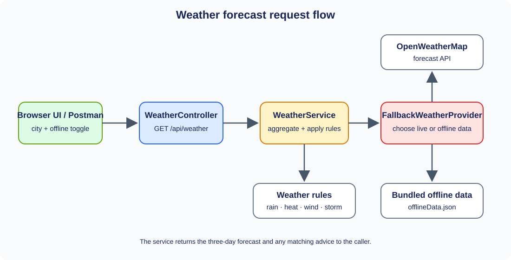

# Weather Prediction

Application that returns next selected days of city forecast highs/lows, forecast windows, and weather advice.

## Run locally

```bash
./mvnw compile spring-boot:run
```

Maven builds the React frontend and packages it into the Spring Boot app. Open [http://localhost:8080](http://localhost:8080). Set `OPENWEATHER_API_KEY` in the environment to enable live data.

## API

`GET /api/weather?city={city}&days={1..5}&offline={true|false}` returns a JSON forecast. `days` defaults to 3. Every day includes a date, Celsius high/low, prediction messages, and time window.

Swagger UI is available at `/swagger-ui/index.html`.

| Status | Meaning |
| --- | --- |
| 200 | Forecast returned from live provider or offline fallback |
| 400 | Missing, blank, or overlong city parameter |
| 503 | Forecast and fallback are both unavailable |


## Design and quality

- **Ports and Strategy:** `WeatherProvider` selects online and local data sources; `FallbackWeatherProvider` applies graceful fallback.
- **Dependency inversion:** `WeatherService` consumes provider and rule abstractions.
- **SOLID:** single-purpose providers/rules and extension through new rule implementations.
- **12 Factor:** configuration via environment, stateless request handling, logs to standard output, and packaged executable artifact.
- **Performance:** one bounded upstream request for all forecast windows, a reusable HTTP client, and aggregation in memory.
- **Offline resilience:** bundled JSON works without network access or an API key.

## Build, test, deploy

```bash
./mvnw clean verify
docker build -t weather-prediction:local .
docker run --rm -p 8080:8080 -e OPENWEATHER_API_KEY="$OPENWEATHER_API_KEY" weather-prediction:local
```

`Jenkinsfile` contains build/test, image build, and local run stages.

The React source is in `frontend/`. Maven downloads the configured Node.js runtime, installs the frontend dependencies, builds the static React assets, and packages them in the executable JAR. Jenkins runs the same Maven build before building the Docker image.

`mvn verify` runs rule tests for exact threshold boundaries and each advice message.

## Request flow


